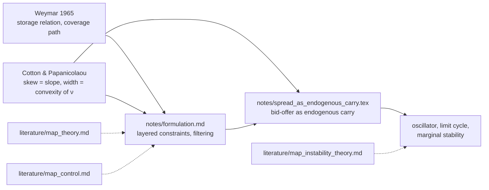

# inventory (view as [web page](https://inventory.microprediction.org/))

Control theory applied to inventory and pricing. A research repository — working notes, preprints and literature maps — extending Cotton & Papanicolaou, *Trading Illiquid Goods*, toward a theory of storable goods with **very low carrying costs**.

## Cite

```bibtex
@unpublished{cotton2026skew,
  author = {Cotton, Peter},
  title  = {On a Simple Relationship Between Order Imbalance, Skew and Width in Over-The-Counter Trading},
  note   = {Working paper; work completed around 2015, first written up 2022},
  year   = {2026},
  url    = {https://github.com/microprediction/inventory}
}
```

## The question

Storage economics stabilizes inventory from below by the stockout constraint and from above by the cost of carry. For value-dense, non-degrading goods the cost of carry can be a few tens of basis points a year — effectively absent. What, then, keeps optimal inventory bounded? The working hypothesis of this repository: nothing physical does. The stabilizer is *microstructural* — the dealer market's bid–offer is the endogenous replacement for the missing carrying cost — and the resulting closed loop behaves as an oscillator with amplitude-dependent damping, parking itself at the edge of stability.

Two documents ground the program:

- **Weymar's 1965 MIT thesis** (distilled in `literature/weymar1965.md`): the spot price of a storable good is a boundary-value problem — the storage relation supplies the *slopes* of the expected-price curve as a function of the expected coverage path, and a long-run anchor expectation supplies the *level*. His behavioural argument for discarding explosive inventory paths leans on carrying costs being material; at tens of basis points it barely binds.
- **Cotton & Papanicolaou, *Trading Illiquid Goods*** (`literature/trading_illiquid.pdf`, unpublished): dealer market making in sealed-bid auctions as stochastic control. The optimal policy is characterized by an inventory indifference cost ν(x) whose slope is the quoted skew and whose convexity is the discretionary width — so the quote surface is the first two derivatives of a storage value function.

Joining the two: the quadratic holding-cost term that entered the dealer model as a convenience is, for low-carry goods, the load-bearing physical object, and several quantities usually modelled independently — inventory, price level, volatility, quoted width and skew — turn out to be linked by layered constraints, in loose analogy with how HJM ties drifts to volatilities (an analogy, not a construction: there is no traded curve here).

## Goals

This repository is for **theory** — papers, preprints, notes written to gather feedback.

1. Formulate the constrained joint dynamics of inventory, price, volatility and dealer width/skew (`notes/formulation.md`), including the filtering problem that arises when flow forecasts are observable but the stock is latent.
2. Characterize the explosive-inventory boundary at low carrying cost — cheap-control singular limits, turnpike loss, and the Van der Pol reading of the commodity cycle (`notes/spread_as_endogenous_carry.tex`).
3. Publish the core results (work completed around 2015) as a clean solo paper — `papers/skew_width_imbalance/skew_width_imbalance.tex` — relating optimal dealer skew and width to flow imbalance (the exact point of departure from Avellaneda & Stoikov: skew responds to imbalance, even at zero inventory). Then revise Cotton & Papanicolaou, *Trading Illiquid Goods*, as the extension, citing it.

Comments — especially from optimal-control readers — are welcome; the notes are written to be attacked.

## Map



## Layout

- `papers/skew_width_imbalance/skew_width_imbalance.tex` — *On a Simple Relationship Between Order Imbalance, Skew and Width in Over-The-Counter Trading* (work completed around 2015): the sealed-bid dealer model, the imbalance equivalence theorem (skew translated, width widened, carry multiplied by 1/(2√(p(1−p)))), zero-inventory skew, and CWLS as a corner case
  - `papers/skew_width_imbalance/verify_local_exponentiality.py` — numerical certificate for the theorem on the grid, and the check that the result survives, with local width, when the win curve is only locally exponential
  - `papers/skew_width_imbalance/novelty_imbalance.md` — verified prior-art review and positioning; `papers/skew_width_imbalance/data_scout_imbalance.md` — public datasets for the empirical section
- `papers/exponential_normal_form/exponential_normal_form.tex` — *Exponential Rigidity and a Log-Value Normal Form for Imbalanced Market Making*: for arbitrary win curves, imbalance is an exact translation in the coordinates of the effective log-value Φ = −log G; rigid strike translations balance the problem exactly for the affine-exponential family κ + Be^(−hK), while rigidity of the submitted quotes, or a finite-mean tail, singles out the exponential (two rigidity theorems and a quote-rigidity corollary); the failure to lift the pointwise gauge to an inventory potential is a curvature functional whose value at the affine point is the widening γ; a one-operator perturbation hierarchy plus envelope transfer covers Weibull, Gompertz, gamma, mixtures and empirical win curves; a distribution-free parity theorem separates what imbalance does by arithmetic (skew odd, width even) from what exponentiality adds (the coefficients)
  - `papers/exponential_normal_form/verify_normal_form.py` — numerical certificate: exact claims at machine precision, expansion remainders at their claimed orders
- `papers/normal_form_rl/architecture.md` — normal-form RL: exact exponential controller + perturbative tangent controller + small learned residual; the critic in the normal coordinates where imbalance vanishes for every win curve; response library, sensitivity-penalized robustness, minimax regret, the anchor as a Bellman control variate
  - `papers/normal_form_rl/verify_tangent_rates.py` — rate certificate: on the bounded lattice the consistency solution is exactly average-reward optimal; regret of the exponential controller is O(ε²) and of the tangent controller O(ε⁴)
- `docs/` — the [web site](https://inventory.microprediction.org/): paper PDF, interactive demos ([symmetry](https://inventory.microprediction.org/symmetry.html), [simulation](https://inventory.microprediction.org/simulation.html); solver in `docs/mm_core.js`), an interactive [literature map](https://inventory.microprediction.org/map.html), and an [annotated bibliography](https://inventory.microprediction.org/bibliography.html)
- `papers/skew_width_imbalance/sifin_cover_letter.tex` — cover letter for the SIAM J. Financial Mathematics short-communication submission
- `notes/formulation.md` — the mathematical formulation: storage relation as a term-structure constraint, transport of the coverage-forecast curve, volatility and width constraints, an MFG aggregation conjecture, the explosiveness boundary, filtering
- `notes/spread_as_endogenous_carry.tex` (+ PDF) — working note: the bid–offer as endogenous cost of carry; the imbalance multiplier; constant-width linear-skew as the fingerprint of the explosive-capable regime; the oscillator; hypotheses and scoreboard
- `notes/parked.md` — ideas deliberately deferred
- `literature/` — the grounding documents and literature maps
  - `weymar1965.md` — distillation of Weymar's thesis
  - `trading_illiquid.pdf` — the Cotton & Papanicolaou deck
  - `map_theory.md` — supply of storage, competitive storage, convenience-yield and HJM-style models, empirics, instability
  - `map_control.md` — the OR/control line: (s,S), servo/bullwhip, joint pricing-inventory control, warehouse problem, market making, MFG, cheap control
  - `map_instability_theory.md` — limit cycles in economics, stability-is-destabilizing, self-organized criticality, the averaging toolkit
